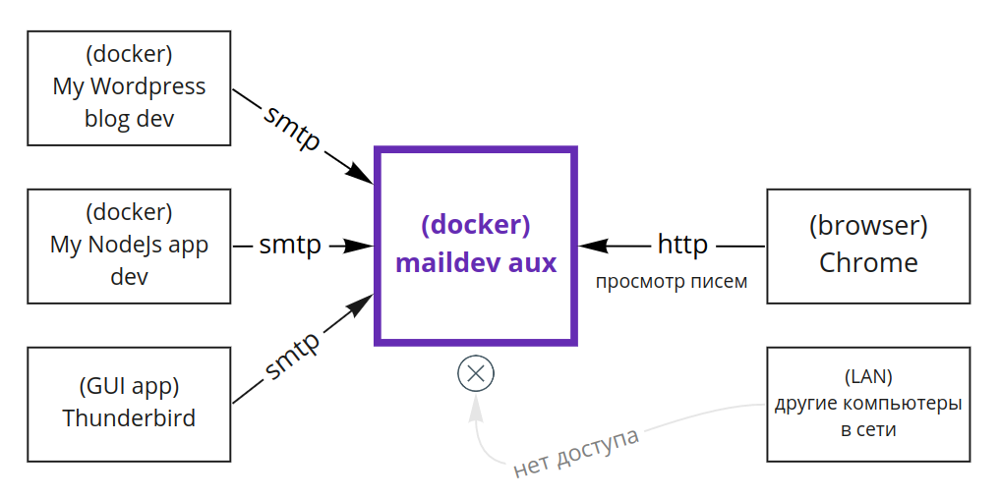

# maildev docker aux

Docker-сервис, предоставляющий возможность отлаживать письма на локальной машине разработчика через стандартные интерфейсы (SMTP и Web).



## Использование

### Подготовка

 1. Определить IP, на котором будет работать сервис (для данного примера используется 172.10.5.0).
 1. Добавить в `/etc/hosts` запись по примеру из файла `etc-hosts`, указать выбранный IP.

### Запуск

```
sudo ./create-net.sh eth10 172.10.5.0
docker-compose up -d
```

### Работа

 * Из приложений (из любых, в том числе из docker-контейнеров) отправляем письма для отладки по SMTP на maildev.dev.doc:25.
 * По адресу http://maildev.dev.doc в браузере просмотриваем содержимое писем (html/plaintext), адресатов, технические заголовки.

## Цель и ценность

Цель данного решения: для разработки, отладки писем, предоставить локальный почтовый сервис, который:
 
 * будет принимать почту по SMTP,
 * будет доступен для всех клиентов локального хоста (в том числе к сервису будет возможен доступ из других контейнеров docker),
 * не будет доступен извне (в том числе не будет доступен из локальной сети),
 * будет предоставлять веб-интерфейс для просмотра писем.
 
Ценность данного решения в том, что появляется возможность отлаживать письма (содержимое, шаблоны писем, заголовки, отправку) на локальной машине разработчика через привычные стандартные интерфейсы (smtp, web). 

## Ограничения

 * Работает только под Linux (в силу необходимости запуска сприпта, добавляющего ip-адрес для сервиса).
 * Для настройки работы в Windows см. радел Contribution.
 * Отправка писем возможна только по SMTP.
 
## Дополнительно

Сервис задумывался как работающий в виде единого инстанса для всех проектов (настраиваем один раз и пользуемся). Но можно настроить и несколько инстансов, например, если каким-то проектам требуются выделенные инстансы для дебага почты именно этих проектов. Для запуска нескольких инстансов достаточно будет лишь разнести их на разные IP. 

## Contribution

Автор заинтересован в добавлении возможности работы решения под Windows (и появлении документации о том, как это сделать). Связаться с автором можно через контакты в профиле GitHub.


