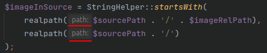

# настройка нового phpstorm

## Мягкие переносы в текстовых файлах (soft wrap)

Когда строка длиннее экрана, редактор отображает её на несколько строк (реально строка не переводится). Удобно, чтобы избежать ручного форматирования в markdown и других тектовых файлах.

Settings | Editor | General | Soft-wrap these files - здесь можно настроить расширегия файлов, в которых требуется soft wrap. Например, txt, markdown.

## 1. Подсказки типов аргументов - отключить



Отключается тут: File | Settings | Editor | Inlay Hints

## 2. Вкладка коммита - положение

Left bottom.

## Вкладки редактора - справа

Правой кнопкой на любую вкладку -> Configure editor tabs -> Tab placement: right.

## Soft wrap перенос пробелов для некоторых типов файлов

Settings | Editor | General | Soft-wrap these files, включить. Список расширений файлов по умолчанию - норм.

## Перемещение в место прошлого редактирования

По умолчанию Ctrl-Alt. Я привык Shift-Alt.

Settings | Keymap -> Main menu -> Navigate -> Back, Forward.

Другие привязанные к этому сочетанию дейтсвия шторм переспросит и отцепит сам.

Перемещается к месту предыдущего редактирования.

## inotify

```
echo fs.inotify.max_user_watches = 5242881 > /etc/sysctl.d/99-phpstorm.conf

sysctl fs.inotify.max_user_watches=5242881
```

## Открытие Diff в отдельном окне, а не во вкладке Editor +

Preferences -> Advanced settings: (группа Version control) Отключить "Open Diff as Editor Tab"

